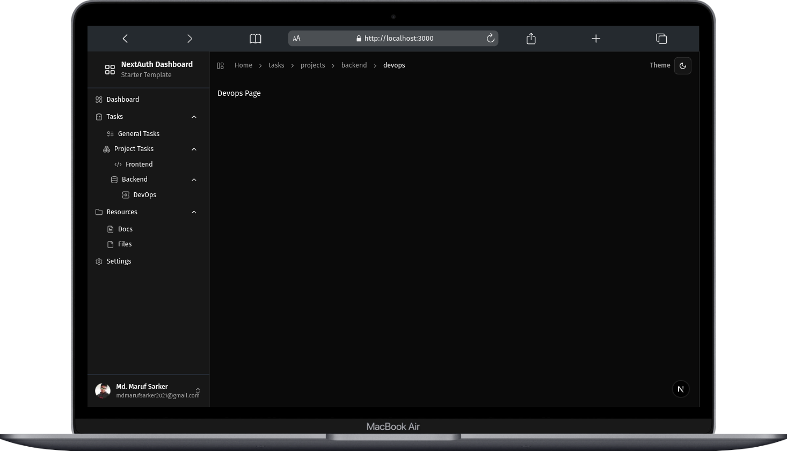

# NextAuth Dashboard Starter

A production-ready **Next.js** starter template featuring authentication and a dashboard layout. Built with **Tailwind CSS**, **ShadCN UI**, and **NextAuth.js** (Google & GitHub login supported). Ideal for SaaS applications, admin panels, and developer dashboards.

## Features

- **Next.js 15+** with App Router and Server Components
- User authentication with **NextAuth.js** supporting Google & GitHub providers
- Responsive, accessible, and customizable dashboard layout
- Sidebar navigation with multi-level menu support
- Built with **Tailwind CSS** & **ShadCN UI** for rapid UI development
- TypeScript ready (optional) and clean, modular codebase
- SEO friendly with server-side rendering (SSR) support
- Docker-ready with CI workflow for automated builds and pushes
- Breadcrumb navigation for easy page context and navigation

## Demo



Try the live demo: <https://next-auth-dashboard-starter.vercel.app>

## Getting Started

### Prerequisites

- Node.js >= 20.x
- npm or yarn or pnpm
- A Google OAuth app (for Google authentication)
- A GitHub OAuth app (for GitHub authentication)

### Installation

```bash
git clone https://github.com/maruf-pfc/next-auth-dashboard-starter.git
cd next-auth-dashboard-starter
pnpm install
```

### Environment Variables

Create a `.env.local` file in the root directory and add your OAuth credentials:

```env
NEXTAUTH_SECRET=your_nextauth_secret
GOOGLE_CLIENT_ID=your_google_client_id
GOOGLE_CLIENT_SECRET=your_google_client_secret
GITHUB_ID=your_github_client_id
GITHUB_SECRET=your_github_client_secret
NEXTAUTH_URL=http://localhost:3000
```

> Replace values with your actual secrets.

### Running Locally

```bash
pnpm run dev
```

Open [http://localhost:3000](http://localhost:3000) to view it in the browser.

### Building for Production

```bash
pnpm run build
pnpm start
```

## Docker Support

### Build and Run Docker Image

```bash
docker build -t next-auth-dashboard-starter .
docker run -p 3000:3000 next-auth-dashboard-starter
```

### GitHub Actions

Automated Docker image build and push is configured in `.github/workflows/docker-image-ci.yml`.

## Authentication

- Uses **NextAuth.js** with built-in Google and GitHub OAuth providers
- Session handling with React hooks `useSession()`
- Protected routes with client-side redirects on logout

## Customization

- Sidebar menu structure configurable via `lib/menu-items.ts`
- UI components built with ShadCN UI, easily extendable
- Tailwind CSS config for theming and styling

## Contributing

Contributions are welcome! Feel free to submit issues or pull requests.

## License

MIT License © [Md. Maruf Sarker](https://github.com/maruf-pfc)

## Contact

If you have questions or want to collaborate, reach out:

- Email: [mdmarufsarker.mms@gmail.com](mailto:mdmarufsarker.mms@gmail.com)
- GitHub: [https://github.com/maruf-pfc](https://github.com/maruf-pfc)
- Twitter: [@md_marufsarker](https://twitter.com/md_marufsarker)
